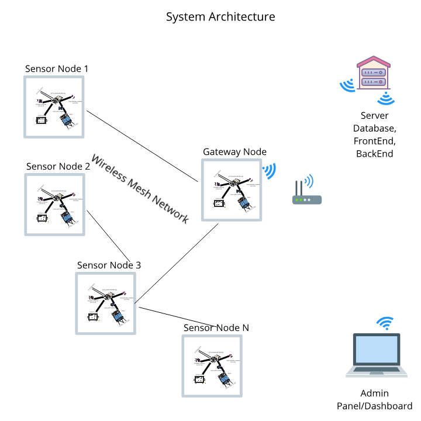
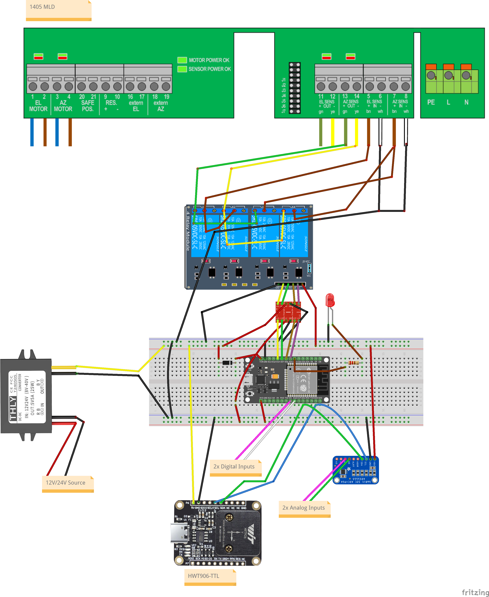
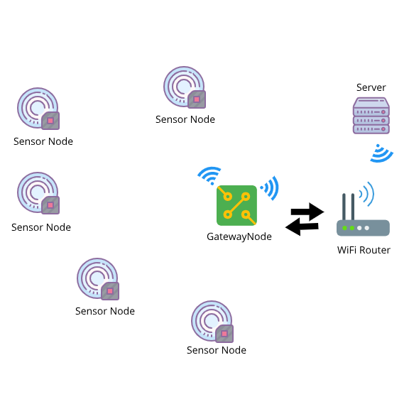

<a name="readme-top"></a>

<!-- PROJECT LOGO -->
<br />
<div align="center">
  <a href="https://github.com/othneildrew/Best-README-Template">
    
  </a>

  <h3 align="center">SmartMotorsMonitor</h3>

  <p align="center">
    Motors Monitoring System with different sensors.
    <br />
  </p>
</div>

---


<p align="center"> SmartMotorsMonitor
    <br> 
</p>

<!-- TABLE OF CONTENTS -->
<details>
  <summary>📝Table of Contents</summary>
  <ol>
    <li>
      <a href="#about-the-project">About The Project</a>
    </li>
    <li><a href="#getting_started">Getting Started</a></li>
    <li><a href="#circuit">Circuit</a></li>
    <li><a href="#architecture">Architecture</a></li>
    <li><a href="#usage">Usage</a></li>
    <li><a href="#webapp">WebApp</a></li>
    <li><a href="#smartphoneapp">SmartphoneApp</a></li>
    <li><a href="#built_using">Built Using</a></li>
    <li><a href="#authors">Authors</a></li>
  </ol>
</details>

<!-- ABOUT THE PROJECT -->
## 🧐 About <a name = "about"></a>

This repo contains

- Firmware
- Circuit Diagram
- Detailed instructions

for Smart Motor Device Monitor.




<p align="right">(<a href="#readme-top">back to top</a>)</p>

## Getting Started <a name = "getting_started"></a>

These instructions will get you a copy of the project up and running on your system.


### Prerequisites

Things you need to install the FW.

```
- Arduino IDE
```

### Installing <a name = "installing"></a>

A step by step series that tell you how to get the Firmware and Backend running

#### ESP32 Configuration

You should have Arduino IDE Installed

  1.  Add ESP32 Board to your Arduino IDE
    1. In your Arduino IDE, go to File> Preferences
        Installing ESP32 Add-on in Arduino IDE Windows, Mac OS X, Linux open preferences
    2. Enter ```https://dl.espressif.com/dl/package_esp32_index.json``` 
        into the “Additional Board Manager URLs” field then, click the “OK” button:
        Note: if you already have the ESP32 boards URL, you can separate the URLs with a comma(each board will go to neaw line) as follows:
        ```https://dl.espressif.com/dl/package_esp32_index.json,\n http://arduino.esp8266.com/stable/package_esp8266com_index.json```
    
    
  2. Open the Boards Manager. Go to Tools > Board > Boards Manager…
  3. Search for ESP32 and press install button for the ESP32 by Espressif Systems“:
  4. That’s it. It should be installed after a few seconds.
  5.   In your Arduino sketchbook directory, create tools directory if it doesn't exist yet.
  6.  Unpack the tool into tools directory(present in libs/ESP32FS-1.0.zip) (the path will look like <home_dir>/Arduino/tools/ESP32FS/tool/esp32fs.jar).
  7.  Close and re-open the Arduino IDE.

  8.  Now copy the contents of the libs folder to the libraries directory of your Arduino
      1. If you are using windows, the libraries directory will be Documents/Arduino/libraries

##### ESP32 Node FW Uploading
  1.  Select ESP32 Dev Module from Tools->Board->ESP32
  2.  Select the correct port from Tools->Port
  3.  Open SensorNode.ino file.
  5.  Upload the Code to your ESP32 Dev Module.
  6.  Your ESP32-based SensorNode is now ready to be used.

##### ESP32 Gateway Node FW Uploading
  1.  Select ESP32 Dev Module from Tools->Board->ESP32
  2.  Select the correct port from Tools->Port
  3.  open GatewayNode.ino file,
  4.  Select Tools > ESP32 Sketch Data Upload menu item. This should start uploading the files into ESP32 flash file system.
  5.  Upload the Code to your ESP32 Dev Module.
  6.  Your ESP32-based Gateway Node is now ready to be used.

<p align="right">(<a href="#readme-top">back to top</a>)</p>

## Circuit <a name = "circuit"></a>


### ESP32 Dev Module Pinout


Follow the pinout diagram given below to connect different components to your board.


### Circuit Diagram for Smart Joystick

Here's the complete circuit diagram of the system.



### Components Connections

```http
Pin connection details
```

#### HWT906-TTL - IMU

```HWT906-TTL Connections with ESP32```

** Remove the HWT906-TTL case to see the connections.

| HWT906-TTL Pins | ESP32 Dev Module Pins| 
| :--- | :--- | 
| `SCL` | `D22` |
| `SDA` | `D21` |
| `VCC` | `5V` |
| `GND` | `GND` |

#### ADS1015 - ADC

```ADS1015 Connections with ESP32```

| ADS1015 Pins | ESP32 Dev Module Pins| 
| :--- | :--- | 
| `SCL` | `D22` |
| `SDA` | `D21` |
| `VCC` | `5V` |
| `GND` | `GND` |

#### Analog Input Pins

```Analog Input Pin Connected with ADS1115```

| Analog Input Pins | ADS1115 Pins| 
| :--- | :--- | 
| `A_IN1` | `A0` |
| `A_IN2` | `A1` |

#### Digital Input Pins

```Digital Input Pin Connections with ESP32```

| Digital Input Pins | ESP32 Dev Module Pins| 
| :--- | :--- | 
| `D_IN1` | `D5` |
| `D_IN2` | `D18` |

#### 4 Channel Relay Pins

```Relay Module Pin Connections with ESP32```

| Relay Module Pins | ESP32 Dev Module Pins| 
| :--- | :--- | 
| `IN1` | `D14` |
| `IN2` | `D27` |
| `IN3` | `D26` |
| `IN4` | `D25` |
| `GND` | `GND` |
| `VCC` | `5V` |

*The relay module is connected to esp32 via Logic Level Shifter*


#### Status RGB LED

```LED Connections```

| LED Pins | ESP32 Dev Module | 
| :--- | :--- | 
| `Anode` | `33 via 220Ω resistor` |
| `Cathode` | `GND` |
*33 is also connected to the internal LED of ESP32 Dev Module*

<p align="right">(<a href="#readme-top">back to top</a>)</p>

## 🔧 Mesh Architecture <a name = "architecture"></a>

High level architecture of the Mesh network


<p align="right">(<a href="#readme-top">back to top</a>)</p>

## Usage <a name = "usage"></a>

```diff
! Ready for testing
```
Power on your Sensor Nodes.

### Gateway Node
1.  Power on your ESP32, it will present you with an AP named ```SmartMM``` (while ```SmartMM``` can be changed in the portal)
2.  Default captive portal password `12345678AP` which can be changed in captive portal.
3.  Connect to the ESP32 access point and open the web-browser and navigate to the link ```http://SmartMM.local/_ac```. This link will work on most of the operating systems but if your operating system is not allowing to open it, you may want to check the captive portal IP Address from the serial monitor and can use that IP address inplace of the above mentioned URL.
4.  The default access IP Address is ```http://192.168.4.1/_ac```
5.  You will be presented with a main dashboard as shown below(based on your device)
   

5.  Once connected to a WiFi network, you can again access the captive portal using same URL or the IP Address from the Serial monitor.
6.  The data is published to the MQTT Topic ```SmartMM/{hostname}``` while the hostname is the one which you can define in Settings page of the captive portal.


### Changing Timezone
```diff
+ Only for developers
```
1.  Open Settings tab
2.  Enter timezone string from https://en.wikipedia.org/wiki/List_of_tz_database_time_zones 'TZ database name' column.
3.  Click Save&Start

### API Endpoints and HTML URLS(for Gateway Node)

```API Endpoints```

| Endpoint | Description | 
| :--- | :--- | 
| `/api-now` | `API: live sensor readings in JSON format` |
| `/api` | `API: sensors data in JSON format` |
| `/LiveSensors` | `HTML PAGE: Live Sensor Data` |
| `/data` | `HTML PAGE: Historical Sensor Data` | 
| `/mqtt_settings` | `HTML PAGE: Settings. Default username: AP Name, Default Password: admin` | 
| `/_ac` | `HTML PAGE: Main Captive portal page` | 
| `/` | `HTML PAGE: Historical Sensor Data` | 


1.  **Connect to WiFi** tab allows searching of nearby WiFi APs and adding them to the ESP32.
   
2.  **Saved WiFi Networks** tab allows connecting to the saved access points.
   
3.  **Reset...** tab allows reseting of the device to factory settings.
    
4.  **Settings** tab contains settings related to MQTT and sensors.
    
5. **HOME** tab shows sensor data acquired live.

<p align="right">(<a href="#readme-top">back to top</a>)</p>

## Web App <a name="webapp"></a>
```diff
+ For future use
```
[Dashboard Link: ]()

You can access the webapp with following test acccount credentials

*   Email Address: `test@test.com`
*   Password: `test`

### Dashboard Screenshots

<p align="right">(<a href="#readme-top">back to top</a>)</p>

## Smartphone App <a name="smartphoneapp"></a>
```diff
+ For future use
```
[Smartphone App Link: ]()

You can access the Smartphone app with following test acccount credentials

*   Email Address: `test@test.com`
*   Password: `test`

### Smartphone App Screenshots

```diff
+ For future use.
```

<p align="right">(<a href="#readme-top">back to top</a>)</p>

## List of Components <a name = "list"></a>
```diff
+ For future use; not a comprehensive list
```
Following components are used to make this project

1.  [ESP32 Dev Kit Module](https://www.amazon.ca/Robojax-Development-Bluetooth-Ultra-Low-Consumption/dp/B07PWGT83P/ref=sr_1_6?crid=FRPQEI8C5TH4&keywords=esp32+devkit&qid=1642575454&sprefix=esp32+devk%2Caps%2C371&sr=8-6)

2. [Micro USB Cable](https://www.amazon.com/Android-Charger-sweguard-Charging-Phone-Grey/dp/B09MT18H3J/ref=sr_1_2_sspa?keywords=micro+usb+cable&qid=1661962441&sprefix=micro+usb+%2Caps%2C181&sr=8-2-spons&psc=1&spLa=ZW5jcnlwdGVkUXVhbGlmaWVyPUEzVkw1N1RQVTVHTVA3JmVuY3J5cHRlZElkPUEwODYyODU0MUdBSDQwTjBWVDZVSiZlbmNyeXB0ZWRBZElkPUEwODMyNjQyMVo4WU1VOVQ5UlMzQiZ3aWRnZXROYW1lPXNwX2F0ZiZhY3Rpb249Y2xpY2tSZWRpcmVjdCZkb05vdExvZ0NsaWNrPXRydWU=)

3. [Compass-IMU9250](https://www.amazon.ca/MPU-9250-MPU9250-Acceleration-Gyroscope-Compass/dp/B07T8J3WCX/ref=sr_1_5?crid=306LGKOVATH5S&keywords=mpu9250&qid=1642575295&sprefix=mpu925%2Caps%2C308&sr=8-5)

4. [ADS1015](https://www.amazon.com/ADS1015-Ultra-Compact-12-Precision-Module-Development/dp/B07V85ZQBN/ref=sr_1_1?keywords=ADS1015&qid=1683352303&sr=8-1)

5. [DC Buck Converter](https://www.amazon.ca/Converter-Waterproof-Voltage-Reducer-Electronics/dp/B08YXHR5GY/ref=sr_1_3_sspa?crid=1FL9EAQLMOKY0&keywords=buck%2Bconverter%2B21vdc&qid=1642575559&sprefix=buck%2Bconverter%2B21vd%2Caps%2C313&sr=8-3-spons&spLa=ZW5jcnlwdGVkUXVhbGlmaWVyPUExUUtXMllCUjhLN0lLJmVuY3J5cHRlZElkPUEwNjQwNzQzMVk1SkJTTUhDQTJYUyZlbmNyeXB0ZWRBZElkPUEwMTAyNzQ1MTlGWExCOEw0VTBYMSZ3aWRnZXROYW1lPXNwX2F0ZiZhY3Rpb249Y2xpY2tSZWRpcmVjdCZkb05vdExvZ0NsaWNrPXRydWU&th=1)

6. [4 Channel Relay Module](https://www.amazon.ca/ELEGOO-Channel-Optocoupler-Arduino-Raspberry/dp/B06XCKQ1M9/ref=sr_1_1_sspa?crid=2IU6OG2T9GSTV&keywords=4+channel+relay&qid=1643175944&sprefix=4+channel+relay%2Caps%2C334&sr=8-1-spons&psc=1&spLa=ZW5jcnlwdGVkUXVhbGlmaWVyPUEyWjM5QU5MUkcwUUlGJmVuY3J5cHRlZElkPUEwNjg2MzkwMU9GQ1VFWDRLNU5OUyZlbmNyeXB0ZWRBZElkPUEwMjg0OTcyM0tSVjZFVkRQNVFDWiZ3aWRnZXROYW1lPXNwX2F0ZiZhY3Rpb249Y2xpY2tSZWRpcmVjdCZkb05vdExvZ0NsaWNrPXRydWU=)

7. [Bi-Directional Logic Level Shifter](https://www.amazon.ca/Channel-Logic-Converter-Bidirectional-Module/dp/B07GRL18G9/ref=sr_1_13?keywords=logic+level+converter+3.3v+5v&qid=1642575729&sprefix=logic+level+%2Caps%2C306&sr=8-13)

8. [Jumper Wires](https://www.amazon.com/EDGELEC-Breadboard-Optional-Assorted-Multicolored/dp/B07GD2BWPY/ref=sr_1_1_sspa?crid=1EFHAMLH1TF1Q&keywords=jumper+wires&qid=1661962101&sprefix=jumper+wire%2Caps%2C197&sr=8-1-spons&psc=1&spLa=ZW5jcnlwdGVkUXVhbGlmaWVyPUFHUFdBUzFHMDVOSlUmZW5jcnlwdGVkSWQ9QTAwNTYwNTAyVDNTNFI5RVI4TTNQJmVuY3J5cHRlZEFkSWQ9QTA5NDU0MzYxSkE3VExKQkZEQUxaJndpZGdldE5hbWU9c3BfYXRmJmFjdGlvbj1jbGlja1JlZGlyZWN0JmRvTm90TG9nQ2xpY2s9dHJ1ZQ==)

<p align="right">(<a href="#readme-top">back to top</a>)</p>

## ⛏️ Built Using <a name = "built_using"></a>

- [Arduino](https://www.arduino.cc/) - Embedded Framework and IDE - For Sensor Node Design

<p align="right">(<a href="#readme-top">back to top</a>)</p>

## 📹 Demo Videos <a name = "demo"></a>
```diff
+ For future use
```
<!-- -   [Device Demo Video]() - Smart Joysticks Device Demo Video -->

<p align="right">(<a href="#readme-top">back to top</a>)</p>

## ✍️ Authors <a name = "authors"></a>

- [@Nauman3S](https://github.com/Nauman3S) - Development and Deployment

<p align="right">(<a href="#readme-top">back to top</a>)</p>